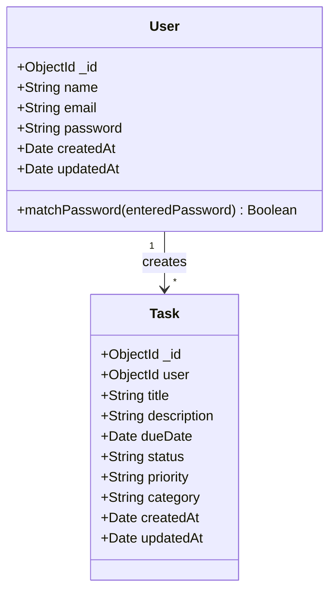
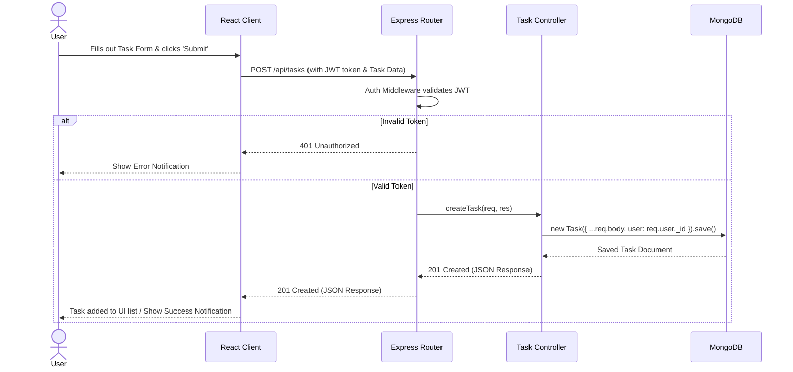

# System Diagrams

This document contains the UML Diagrams for the Student Task Manager system.

## 1. Use Case Diagram

The Use Case Diagram describes the primary actors and their interactions with the system.

```mermaid
usecaseDiagram
    actor Student
    
    rectangle "TaskFlow System" {
        usecase "Register Account" as UC1
        usecase "Login" as UC2
        usecase "Manage Tasks" as UC3
        usecase "View Calendar" as UC4
        usecase "Use Pomodoro Timer" as UC5
        usecase "View Statistics" as UC6
        usecase "Create Task" as UC3_1
        usecase "Edit Task" as UC3_2
        usecase "Delete Task" as UC3_3
    }

    Student --> UC1
    Student --> UC2
    Student --> UC3
    Student --> UC4
    Student --> UC5
    Student --> UC6
    
    UC3 ..> UC3_1 : <<includes>>
    UC3 ..> UC3_2 : <<includes>>
    UC3 ..> UC3_3 : <<includes>>
```

## 2. Class Diagram

The Class Diagram outlines the data structures (models) and their attributes/relationships.



## 3. Sequence Diagram: Task Creation Flow

This diagram illustrates the flow of messages between the client, server, and database when a user creates a new task.


